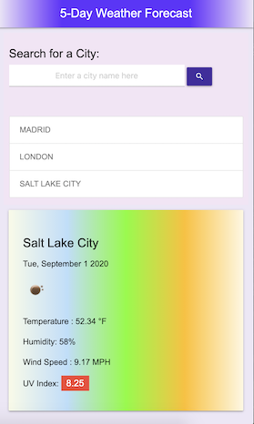
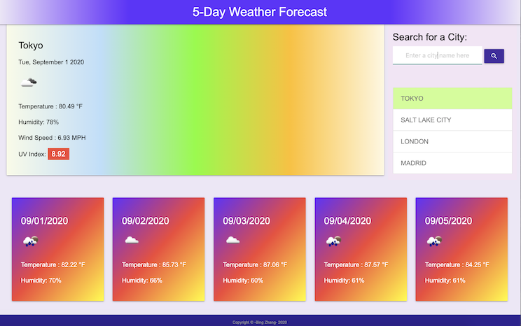

# 5-Day-Weather-Forecast-APP

## Table of Content
1. [ Project Links ](#Links)
2. [ Project Context ](#context)
3. [ Project Objectives ](#objectives)
4. [ Outcome ](#Outcome)
5. [ Screenshots ](#Screenshots)
6. [Challenges & What I've Learned](#learned)
7. [Installation](#Installation)
8. [Credits](#Credits)
9. [ License ](#License)
#

       
#

### 1. Project Links 

#### Website Link
https://imbingz.github.io/5-Day-Weather-Forecast-APP/

#### Work-Files Link
https://github.com/imbingz/5-Day-Weather-Forecast-APP

### 2. Project Context - User Story
* For many especially travelers it is necessary to check weather outlook for multiple cities with a 5-day weather forecast information and plan a trip accordingly. 
* Users can search for a city and are presented with current and future conditions for that city and that city is added to the search history
* Users can view current weather conditions for that city including city name, the date, an icon representation of weather conditions, the temperature, the humidity, the wind speed, and the UV index. 
* the UV index will be color coded to indicate whether the conditions are favorable, moderate, or severe
* Users can view a 5-day forecast that displays the date, an icon representation of weather conditions, the temperature, and the humidity
* When users click on a city in the search history, they are presented with current and future conditions for that city. 
* The last searched city forecast will be shown When users open the weather dashboard. 

### 3. Project Objectives
* Use the OpenWeather API to retrieve weather data for cities and build a weather dashboard that will run in the browser and feature dynamically updated HTML and CSS powered by JavaScript code.

* It will also feature a clean and polished user interface and be responsive, ensuring that it adapts to multiple screen sizes.

### 4. Outcome
* The user interface is responsive to different devices - mobile, tablets, laptops and larger screen desktops
* The app is dynamic and functional with current and 5-day weather forecast. 
* Utilized Local Storage to save user search histories. 

### 5. Screenshots 

#### Screenshots - Mobile View
<kbd></kbd>
<kbd></kbd>

####  Screenshots - Laptop view 
<kbd></kbd>

### 6. Challenges & What I've Learned
* The challeng started with UI. I wanted to try a new framwork besides Bootstrap, so I used Materialize CSS for the first time. I used 9 col for large screen to display 5 sub-divided col. I could not achieve the result with Materialize grid system, so I used css to give each sub-col 20% of the fiull width of 9-col. 
* I know Promise.all() will be better method to use when calling multiple apis at once. However, I could not make it work in my codes when changing 2 separate ajax calls to one promise.all. 
* How to choose the right date to display for each of 5-day forecast was a challenge. After looking into the response object and some research, I noticed that open weather api records 8 times through out a day, the index 0 is for current day, index 1-8 is for the next day, index 9-17 and so on. So, let the index increase by 8 for each loop will give me what I am looking for. 
* For best user experience, I wanted to display the latest search city history at the very top, and also I don't want to display the same city more than once. There are couple of ways to accomplish that after some research, and I chose to use array.filter() along with unshit() and indexOf(). 

### 7. Installation
* Access to GitHub.com and a code editor such as vscode is necessary
* Go to [github.com/imbingz](https://github.com/imbingz/5-Day-Weather-Forecast-APP)
* Click on the green button that says Clone or Download
* Choose how you would like to download: using the SSH/HTTPS keys or download the zip file
* Using SSH/HTTPS Key: You will copy the link shown and open up either terminal (mac: pre-installed) or gitbash (pc: must be installed). Once the application is open, you will type git clone paste url here. Once you have cloned the git repo, cd into the repo and type open. to open the folder which contains all files used for the website. Once inside the folder, click on index.html to open the website in the browser.
* Using Download ZIP: Click on Download Zip. Locate the file and double click it to unzip the file. Locate the unzipped folder and open it. All the files for the website will be within this folder. Click on index.html to open the website in the browser.
* If you like to test this Weather Forecast App, please click the link [here](https://imbingz.github.io/5-Day-Weather-Forecast-APP/)

### 8. Credits:
It is not possible to complete this project without the coding online communities and recources such as stackoverflow.com, mozilla developer network and the following teams. 

* [Mozilla HTML5 Guide](https://developer.mozilla.org/en-US/docs/Web/Guide/HTML/HTML5) 
* [w3 School CSS3](https://www.w3schools.com/css/css_intro.asp) 
* [Mozilla JavaScript](https://developer.mozilla.org/en-US/docs/Web/JavaScript) 
* [JQuey API](https://api.jquery.com/) 
* [moment.js](https://momentjs.com/) 
* [Google Fonts](https://fonts.google.com/) 
* [Visual Studio Code](https://code.visualstudio.com/) 
* [w3 code validator](https://validator.w3.org/) 
* [Materialize CSS](https://materializecss.com/about.html)
* [YouTube - Build Weather APP with Weather Map API](https://www.youtube.com/watch?v=KT6Jaxl0JM4&list=PLAEoBV_GLyq4klW-2Pm75_5-r4oHhwqlm&index=4)
* [YouTube-How to Use New York Time API to Search Articles](https://www.youtube.com/watch?v=QiIlhmeGYuk)
* [OpenWeather API](https://openweathermap.org/)
* [UV Index Levels](https://en.wikipedia.org/wiki/Ultraviolet_index#:~:text=A%20UV%20index%20reading%20of%203%20to%205%20means%20moderate,when%20the%20Sun%20is%20strongest.&text=A%20UV%20index%20reading%20of%206%20to%207%20means%20high,and%20eye%20damage%20is%20needed.)

### 9. License
##### MIT License

Copyright (c) [2020] [bingzhang]

Permission is hereby granted, free of charge, to any person obtaining a copy of this software and associated documentation files (the "Software"), to deal in the Software without restriction, including without limitation the rights to use, copy, modify, merge, publish, distribute, sublicense, and/or sell copies of the Software, and to permit persons to whom the Software is furnished to do so, subject to the following conditions:

The above copyright notice and this permission notice shall be included in all copies or substantial portions of the Software.

THE SOFTWARE IS PROVIDED "AS IS", WITHOUT WARRANTY OF ANY KIND, EXPRESS OR IMPLIED, INCLUDING BUT NOT LIMITED TO THE WARRANTIES OF MERCHANTABILITY, FITNESS FOR A PARTICULAR PURPOSE AND NON-INFRINGEMENT. IN NO EVENT SHALL THE AUTHORS OR COPYRIGHT HOLDERS BE LIABLE FOR ANY CLAIM, DAMAGES OR OTHER LIABILITY, WHETHER IN AN ACTION OF CONTRACT, TORT OR OTHERWISE, ARISING FROM, OUT OF OR IN CONNECTION WITH THE SOFTWARE OR THE USE OR OTHER DEALINGS IN THE SOFTWARE.

August 26, 2020.

